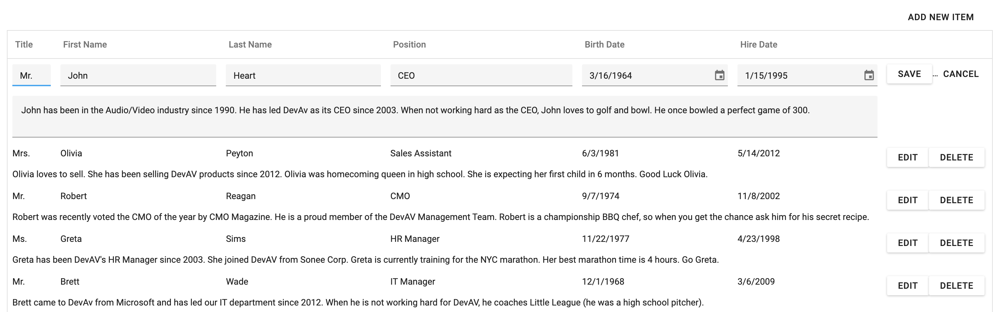

<!-- default badges list -->

<!-- default badges end -->

# DataGrid for DevExtreme - Editing with dataRowTemplate

This example creates a custom template for rows in edit mode. It also allows users to insert or delete rows. Follow the steps below to create an application with similar functionality. 

- Implement a [dataRowTemplate](https://js.devexpress.com/Documentation/ApiReference/UI_Components/dxDataGrid/Configuration/#dataRowTemplate) to create custom templates for rows in view and edit modes.

- Call [editRow()](https://js.devexpress.com/Documentation/ApiReference/UI_Components/dxDataGrid/Methods/#editRowrowIndex), [deleteRow()](https://js.devexpress.com/Documentation/ApiReference/UI_Components/dxDataGrid/Methods/#deleteRowrowIndex), [saveEditData()](https://js.devexpress.com/Documentation/ApiReference/UI_Components/dxDataGrid/Methods/#saveEditData), and [cancelEditData()](https://js.devexpress.com/Documentation/ApiReference/UI_Components/dxDataGrid/Methods/#cancelEditData) methods to start/stop edit operations or delete rows.

- Implement the [onToolbarPreparing](https://js.devexpress.com/Documentation/ApiReference/UI_Components/dxDataGrid/Configuration/#onToolbarPreparing) event handler to create a custom button that inserts a new row. Use [onInitNewRow](https://js.devexpress.com/Documentation/ApiReference/UI_Components/dxDataGrid/Configuration/#onInitNewRow) to initialize new row cells.

- Modify the [editing.changes](https://js.devexpress.com/Documentation/ApiReference/UI_Components/dxDataGrid/Configuration/editing/changes/) array when an editor's value is changed.

## Files to Review

- **jQuery**
  - [index.js](jQuery/src/index.js)
- **Angular**
  - [app.component.html](Angular/src/app/app.component.html)
  - [app.component.ts](Angular/src/app/app.component.ts)
  - [data-row-template.component.html](Angular/src/app/data-row-template/data-row-template.component.html)
  - [data-row-template.component.ts](Angular/src/app/data-row-template/data-row-template.component.ts)
  - [edit-row-template.component.html](Angular/src/app/edit-row-template/edit-row-template.component.html)
  - [edit-row-template.component.ts](Angular/src/app/edit-row-template/edit-row-template.component.ts)
- **Vue**
  - [HomeContent.vue](Vue/src/components/HomeContent.vue)
  - [DataRowTemplate.vue](Vue/src/components/DataRowTemplate.vue)
  - [EditRowTemplate.vue](Vue/src/components/EditRowTemplate.vue)
- **NetCore**
  - [Index.cshtml](ASP.NET%20Core/Views/Home/Index.cshtml)
  - [_DataRowTemplate.cshtml](ASP.NET%20Core/Views/Home/_DataRowTemplate.cshtml)
  - [_EditRowTemplate.cshtml](ASP.NET%20Core/Views/Home/_EditRowTemplate.cshtml)

## Documentation

- [dataRowTemplate](https://js.devexpress.com/Documentation/ApiReference/UI_Components/dxDataGrid/Configuration/#dataRowTemplate)
- [onToolbarPreparing](https://js.devexpress.com/Documentation/ApiReference/UI_Components/dxDataGrid/Configuration/#onToolbarPreparing)
- [onInitNewRow](https://js.devexpress.com/Documentation/ApiReference/UI_Components/dxDataGrid/Configuration/#onInitNewRow)
- [editing.changes](https://js.devexpress.com/Documentation/ApiReference/UI_Components/dxDataGrid/Configuration/editing/changes/)

## More Examples

- [DevExtreme DataGrid – Create a custom Pop-up Edit Form using Popup and Form components](https://github.com/DevExpress-Examples/devextreme-datagrid-custom-editing-form)
- [DataGrid for DevExtreme - How to handle different value types with editCellTemplate for the same column](https://github.com/DevExpress-Examples/devextreme-datagrid-dynamic-type-column)
- [DataGrid for DevExtreme - How to define DataGrid in the Popup Edit Form to edit a data field](https://github.com/DevExpress-Examples/devextreme-datagrid-show-grid-in-popup-edit-form)
<!-- feedback -->
## Does this example address your development requirements/objectives?

 

(you will be redirected to DevExpress.com to submit your response)
<!-- feedback end -->
